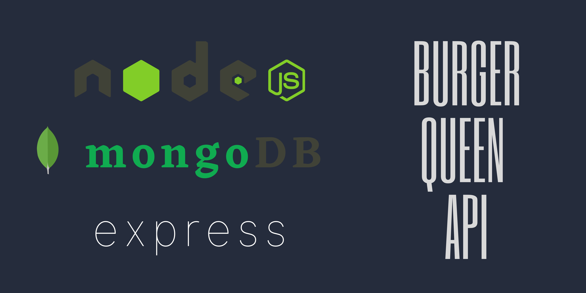

# Burger Queen - API con Node.js


## Índice

* [1. Reto](#1-reto)
* [2. Proyecto](#2-proyecto)
* [3. Requisitos](#3-requisitos)
* [4. Interfaz de linea de comandos](#4-interfaz-de-linea-de-comandos)
* [5. Variables de entorno](#5-variables-de-entorno)

## 1. Reto

Un pequeño restaurante de hamburguesas, que está creciendo, necesita un
sistema a través del cual puedan tomar pedidos usando una _tablet_, y enviarlos
a la cocina para que se preparen ordenada y eficientemente.

Este proyecto tiene dos áreas: interfaz web (cliente) y API (servidor). Nuestra
clienta nos ha solicitado desarrollar la API que se debe integra con la
interfaz, que otro equipo de desarrolladoras está trabajando simultáneamente.

## 2. Proyecto

Con una API en este caso nos referimos a un _servidor web_, nuestro servidor web debe _manejar_ consultas entrantes y producir respuestas a esas
consultas que serán enviadas de vuelta al _cliente_. Cuando hablamos de
_aplicaciones de servidor_.
donde el cliente es un programa que hace consultas a través de una red (por
ejemplo el navegador, cURL, ...), y el _servidor_ es el programa que recibe
estas consultas y las responde.

Partimos de un _boilerplate_ que ya contiene una serie de
_endpoints_ (puntos de conexión o URLs).

La clienta nos ha dado un [link a la documentación](https://laboratoria.github.io/burger-queen-api/)
que especifica el comportamiento esperado de la API que expondremos por
HTTP. Ahí puedes encontrar todos los detalles de qué _endpoints_ debe
implementar la aplicación, qué parámetros esperan, qué deben responder, etc.

Las herramientas para desarrollar esta  _aplicación de servidor_ son:
- **Node.js**
- **Express** como framework
- **MongoDB** como base datos 
- Contenedores de **Docker**.

Este proyecto es un servidor web que debe estar en `JSON` sobre `HTTP`, y también cuenta con un despliegue en la nube..

## 3. Requisitos

### 3.1 HTTP/JSON API

Especificación de endpoints

## `auth`

## `users`

## `products`

## `orders`


Según lo establecido por la [documentación](https://laboratoria.github.io/burger-queen-api/)
entregada por nuestra clienta, la API debe exponer los siguientes endpoints:

#### 3.1.1 `/`

* `GET /`

#### 3.1.2 `/auth`

* `POST /auth`

#### 3.1.3 `/users`

* `GET /users`
* `GET /users/:uid`
* `POST /users`
* `PUT /users/:uid`
* `DELETE /users/:uid`

#### 3.1.4 `/products`

* `GET /products`
* `GET /products/:productid`
* `POST /products`
* `PUT /products/:productid`
* `DELETE /products/:productid`

#### 3.1.5 `/orders`

### 3.2 Test

Los tests deben cubrir un mínimo del 90% de _statements_, _functions_,
_lines_ y _branches_. 

Otro requerimiento del equipo de QA de nuestra clienta es realizar
**pruebas _end-to-end_**, que usaremos para verificar el comportamiento desde el punto de vista de HTTP, desde afuera del servidor. 

* `GET /orders`
* `GET /orders/:orderId`
* `POST /orders`
* `PUT /orders/:orderId`
* `DELETE /orders/:orderId`

### 4.1 Interfaz de linea de comandos

La clienta nos ha solicitado que la aplicación cuente un comando **`npm start`**
que se debe encargar de ejecutar nuestra aplicación node y que además pueda
recibir información de configuración, como el puerto en el que escuchar, a qué
base datos conectarse, etc. Estos datos de configuración serán distintos entre
diferentes entornos (desarrollo, producción, ...). El _boilerplate_ ya implementa
[el código necesario](config.js) para leer esta información de los
[argumentos de invocación](https://nodejs.org/docs/latest/api/process.html#process_process_argv)
y el
[entorno](https://nodejs.org/docs/latest/api/process.html#process_process_env).

#### 4.1.1 Argumentos de línea de comando

Podemos especificar el puerto en el que debe arrancar la aplicación pasando un
argumento a la hora de invocar nuestro programa:

```sh
# Arranca la aplicación el puerto 8888 usando npm
npm start 8888
```

### 5. Variables de entorno

Nuestra aplicación usa las siguientes variables de entorno:

* `PORT`:  Valor por defecto `8080`.
* `DB_URL`: Conexión de _MongoDB_. Cuando ejecutemos la aplicación en nuestra computadora (en entorno de desarrollo), podemos usar el una base de datos local, pero en producción deberemos utilizar las instancias configuradas con `docker-compose` (mas sobre esto en la siguiente sección de
  **Deployment**)
* `JWT_SECRET`: Implementamos la autenticación usando JWT (JSON Web Tokens). Para poder firmar (cifrar) y verificar (descifrar) los tokens, nuestra aplicación necesita un secreto. En local puedes usar el valor por defecto (`xxxxxxxx`), pero es muy importante que uses un _secreto_ de verdad en producción.
* `ADMIN_EMAIL`: Valor por defecto `admin@localhost`.
* `ADMIN_PASSWORD`: Valor por defecto: `changeme`.


---

